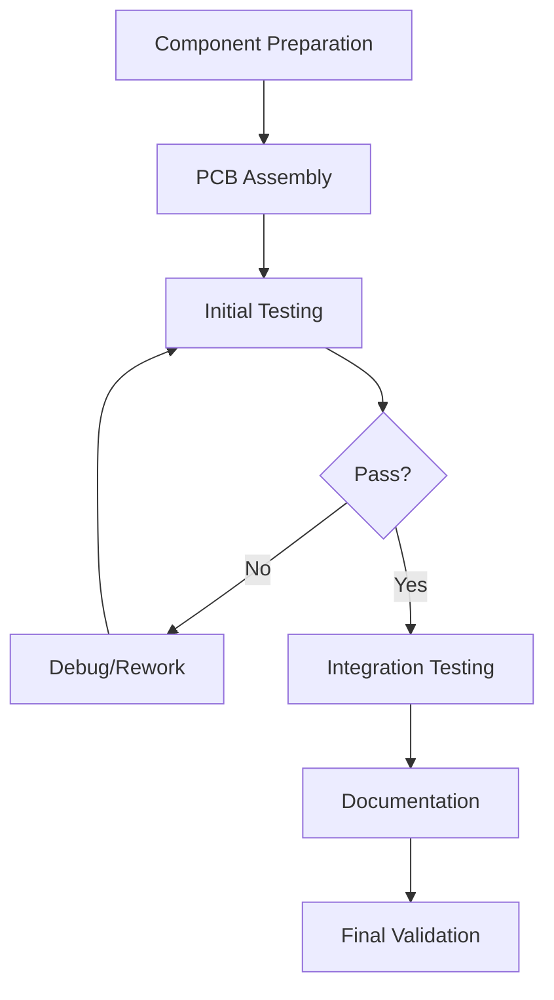

# 🔧 ESP32 Wildlife CAM - Workbench Setup Guide

## Overview
This guide provides comprehensive instructions for setting up a professional development and testing workbench for ESP32 Wildlife CAM development, including tool organization, safety protocols, and workflow optimization.

## 🎯 Workbench Objectives

### Primary Goals
- **Safe workspace** for electronics development and testing
- **Efficient workflow** for assembly, testing, and debugging
- **Professional quality** results and documentation
- **Scalable setup** from hobbyist to production levels
- **Offline capability** for firewall-constrained environments

### Success Criteria
- **Sub-5 minute** component testing turnaround
- **Zero safety incidents** during development
- **>95% first-time** assembly success rate
- **Professional documentation** and photo quality
- **Complete offline** development capability

## 🏗️ Physical Workbench Setup

### Essential Workbench Requirements
| Component | Specification | Purpose | Priority |
|-----------|---------------|---------|----------|
| **Work Surface** | 4ft x 2ft minimum | Component layout and assembly | Critical |
| **ESD Mat** | Anti-static rubber | Component protection | Critical |
| **Task Lighting** | 2000+ lumens adjustable | Detailed work visibility | Critical |
| **Power Strip** | Surge protected 8+ outlets | Tool power management | High |
| **Storage System** | Drawer/bin organization | Component and tool storage | High |
| **Ventilation** | Fume extraction capability | Soldering safety | High |

### Workbench Layout Diagram
```
    [Fume Extractor]     [Task Lights]
          ↑                   ↓
┌─────────────────────────────────────────┐
│  SOLDERING ZONE  │    ASSEMBLY ZONE     │
│  [Iron] [Flux]   │  [Components] [Tools]│
│  [Solder] [Wick] │  [Breadboard] [Wires]│
├─────────────────────────────────────────┤
│     TESTING ZONE     │  DOCUMENTATION   │
│ [Multimeter] [Logic] │ [Camera] [Laptop] │
│ [Power Supply] [Load]│ [Notebook] [Refs] │
└─────────────────────────────────────────┘
    [Storage Drawers]     [Cable Management]
```

### Ergonomic Considerations
- **Chair height**: Adjustable to 26-30" for comfort
- **Monitor position**: Eye level to reduce neck strain
- **Tool reach**: All frequently used tools within arm's reach
- **Standing option**: Adjustable height desk preferred
- **Foot rest**: For extended sitting periods

## 🔧 Essential Tool Inventory

### Soldering Equipment
| Tool | Specification | Brand Recommendation | Est. Cost | Priority |
|------|---------------|---------------------|-----------|----------|
| **Soldering Iron** | 60W adjustable temp | Hakko FX-888D | $100 | Critical |
| **Solder** | 63/37 0.6mm rosin core | Kester 44 | $20 | Critical |
| **Flux** | No-clean liquid flux | ChipQuik SMD291 | $15 | Critical |
| **Desoldering Wick** | 2.8mm width | ChipQuik SW-Wick | $8 | High |
| **Tip Cleaner** | Brass sponge | Hakko 599B | $25 | High |
| **Fume Extractor** | Activated carbon filter | Weller WSA350 | $150 | High |

### Measurement Equipment
| Tool | Specification | Purpose | Est. Cost | Priority |
|------|---------------|---------|-----------|----------|
| **Digital Multimeter** | True RMS, 6000 counts | Voltage/current/resistance | $80 | Critical |
| **Logic Analyzer** | 8+ channels, 100MHz | Digital signal debugging | $50 | High |
| **Oscilloscope** | 2ch 100MHz+ | Analog signal analysis | $300+ | Medium |
| **Power Supply** | Variable 0-30V 0-3A | Component testing | $100 | High |
| **Function Generator** | 1Hz-1MHz sine/square | Signal generation | $80 | Medium |
| **LCR Meter** | Inductance/capacitance | Component verification | $60 | Low |

### Hand Tools
| Tool | Specification | Purpose | Est. Cost | Priority |
|------|---------------|---------|-----------|----------|
| **Wire Strippers** | 22-30 AWG precision | Cable preparation | $25 | Critical |
| **Needle Nose Pliers** | ESD safe | Component manipulation | $20 | Critical |
| **Flush Cutters** | Sharp precision | Clean cuts | $15 | Critical |
| **Screwdriver Set** | Precision electronics | Assembly/disassembly | $30 | High |
| **Tweezers** | Anti-static fine tip | SMD component handling | $15 | High |
| **Heat Gun** | Variable temperature | Heat shrink, desoldering | $40 | Medium |

### Assembly Hardware
| Item | Specification | Quantity | Purpose | Est. Cost |
|------|---------------|----------|---------|-----------|
| **Breadboards** | Half size, 400 tie points | 5 | Prototyping | $25 |
| **Jumper Wires** | M-M, M-F, F-F sets | 200+ | Connections | $20 |
| **Headers** | 2.54mm pitch various | 50+ | PCB connections | $15 |
| **Heat Shrink** | Various sizes/colors | 1 kit | Wire protection | $20 |
| **Wire** | 22AWG solid/stranded | 5 colors | Point-to-point wiring | $30 |

## 💻 Software Development Environment

### Primary Development Tools
| Software | Version | Purpose | Installation | License |
|----------|---------|---------|-------------|----------|
| **PlatformIO IDE** | Latest | Primary development | VS Code extension | Free |
| **Arduino IDE** | 2.0+ | Backup/compatibility | Download installer | Free |
| **ESP-IDF** | v5.0+ | Advanced ESP32 features | espressif.com | Free |
| **Git** | Latest | Version control | git-scm.com | Free |
| **Python** | 3.8+ | Automation scripts | python.org | Free |

### Debugging and Analysis Tools
| Tool | Purpose | Installation | Cost |
|------|---------|-------------|------|
| **ESP32 Exception Decoder** | Stack trace analysis | PlatformIO plugin | Free |
| **WiFi Analyzer** | Network debugging | Mobile app | Free |
| **Serial Monitor** | Real-time logging | Built-in tools | Free |
| **Logic Analyzer Software** | Digital signal analysis | Sigrok/PulseView | Free |
| **Oscilloscope Software** | Waveform analysis | Vendor specific | Varies |

### Offline Development Setup
```bash
# Complete offline environment setup
./scripts/setup_offline_environment.sh --complete

# Verify offline capability
./scripts/quick_validate.sh --offline_check

# Cache all dependencies
./scripts/setup_development.sh --cache_all_dependencies
```

## 📋 Workbench Organization System

### Component Storage Strategy
```
Storage Hierarchy:
├── Active Project Bins
│   ├── ESP32 Modules (current batch)
│   ├── Sensors (test components)
│   └── Power Components (batteries, chargers)
├── General Component Library
│   ├── Passive Components (R, C, L)
│   ├── Active Components (ICs, transistors)
│   ├── Mechanical (connectors, switches)
│   └── Cables/Wires (organized by type)
└── Tools & Consumables
    ├── Soldering Supplies
    ├── Hardware (screws, standoffs)
    └── Documentation/References
```

### Labeling System
- **Color coding**: Red (power), Blue (signal), Green (ground), Yellow (data)
- **Part numbers**: Clearly visible on all component bins
- **Quantity tracking**: Current count and reorder threshold
- **Date codes**: Track aging of time-sensitive components

### Inventory Management
```bash
# Digital inventory tracking
python3 scripts/workbench_inventory.py --scan_components
python3 scripts/workbench_inventory.py --reorder_check
python3 scripts/workbench_inventory.py --project_allocation
```

## 🔬 Testing and Validation Setup

### Component Test Stations
| Station | Purpose | Equipment | Automation Level |
|---------|---------|-----------|------------------|
| **Power Test** | Battery/charging validation | PSU, load, multimeter | Semi-automated |
| **Sensor Test** | Environmental sensor cal | Test chamber, standards | Manual |
| **Camera Test** | Image quality validation | Light box, targets | Automated |
| **Communication Test** | WiFi/LoRa range testing | RF equipment | Manual |

### Automated Test Integration
```bash
# Workbench test automation
./scripts/workbench_test_automation.py --station power \
    --component esp32_cam \
    --duration 30m

# Component qualification test
./scripts/component_qualification.py --batch_test \
    --components sensors,power,camera \
    --generate_report
```

### Quality Control Procedures
1. **Incoming inspection** - All components tested before storage
2. **Assembly validation** - Each completed unit tested
3. **Burn-in testing** - Extended operation before deployment
4. **Documentation** - All tests recorded and traceable

## 📸 Documentation and Photography Setup

### Photography Equipment
| Equipment | Purpose | Specification | Est. Cost |
|-----------|---------|---------------|-----------|
| **DSLR Camera** | High-quality documentation | 20MP+, macro capability | $600+ |
| **Macro Lens** | PCB/component detail | 100mm macro, 1:1 ratio | $400+ |
| **Copy Stand** | Stable photography | Adjustable height/angle | $150 |
| **LED Light Panel** | Even illumination | 5600K color temperature | $100 |
| **Tripod** | Camera stability | Sturdy, adjustable | $80 |

### Documentation Standards
- **Assembly photos**: Before, during, after each major step
- **Wiring diagrams**: Clear, annotated connection photos
- **Component closeups**: Part numbers visible for BOM verification
- **Test results**: Screenshots of all measurement displays
- **Issue documentation**: Clear photos of problems and solutions

### Photo Organization
```
Documentation Structure:
├── Assembly_Photos/
│   ├── 2025-09-01_ESP32-CAM_Assembly/
│   ├── Component_Validation/
│   └── Issue_Resolution/
├── Wiring_Diagrams/
│   ├── Power_Distribution/
│   ├── Sensor_Connections/
│   └── Camera_Interface/
└── Test_Results/
    ├── Performance_Benchmarks/
    ├── Environmental_Testing/
    └── Field_Validation/
```

## ⚡ Power and Safety Management

### Electrical Safety Setup
- **GFCI outlets** for wet work protection
- **Emergency shutdown** easily accessible
- **Fire extinguisher** suitable for electrical fires (Class C)
- **First aid kit** including burn treatment
- **Eye wash station** for chemical emergencies

### ESD Protection Protocol
1. **Wrist strap connection** before handling components
2. **Anti-static mat** grounded to same point as wrist strap
3. **Component storage** in anti-static bags/containers
4. **Humidity control** 40-60% to reduce static buildup
5. **Ionized air** for additional static neutralization

### Power Distribution
```
Workbench Power Layout:
Main Circuit (20A) ─┬─ High Power Tools (Soldering, Heat Gun)
                    ├─ Test Equipment (PSU, Oscilloscope)
                    ├─ Computers/Monitors
                    └─ Task Lighting
UPS Backup (1kVA) ──┬─ Computer Systems
                    └─ Critical Test Equipment
```

## 🛠️ Workflow Optimization

### Daily Setup Routine
1. **Safety check** - Verify all safety equipment functional
2. **Tool inventory** - Ensure all required tools available
3. **Component prep** - Stage components for day's work
4. **Documentation ready** - Camera, notebook, references
5. **Test equipment** - Power on and warm up instruments

### Efficient Assembly Process


### Batch Processing Strategy
- **Component preparation** - Pre-strip wires, prep headers
- **Assembly line** - Build multiple units simultaneously
- **Test batching** - Test multiple units at same time
- **Documentation bulk** - Photograph all units together

## 📊 Performance Metrics

### Workbench Efficiency Targets
| Metric | Target | Measurement Method |
|--------|--------|--------------------|
| **Assembly Time** | <2 hours/unit | Stopwatch timing |
| **First Pass Yield** | >95% | Success rate tracking |
| **Rework Rate** | <5% | Issue classification |
| **Safety Incidents** | 0 | Incident reporting |
| **Tool Utilization** | >80% | Time tracking |

### Continuous Improvement
```bash
# Workbench metrics tracking
python3 scripts/workbench_metrics.py --daily_report
python3 scripts/workbench_metrics.py --efficiency_analysis
python3 scripts/workbench_metrics.py --improvement_suggestions
```

## 📋 Maintenance and Calibration

### Regular Maintenance Schedule
| Equipment | Frequency | Procedure | Notes |
|-----------|-----------|-----------|-------|
| **Soldering Iron** | Weekly | Tip cleaning, temperature check | Replace tips monthly |
| **Multimeter** | Monthly | Calibration verification | Professional cal yearly |
| **Power Supply** | Monthly | Output accuracy check | Load regulation test |
| **ESD Equipment** | Weekly | Resistance measurement | <1MΩ wrist strap |

### Calibration Standards
- **Voltage reference** - Precision 10V standard
- **Current shunt** - Calibrated 1A/100mV
- **Frequency standard** - 10MHz crystal oscillator
- **Temperature reference** - Ice point/boiling point

## 📖 Advanced Workbench Features

### Optional Professional Upgrades
| Feature | Benefit | Est. Cost | Priority |
|---------|---------|-----------|----------|
| **Pick & Place Machine** | SMD assembly speed | $2000+ | Low |
| **Reflow Oven** | Professional SMD soldering | $1500+ | Low |
| **3D Printer** | Custom enclosures/mounts | $500+ | Medium |
| **Spectrum Analyzer** | RF debugging | $1000+ | Low |
| **Environmental Chamber** | Temperature testing | $3000+ | Low |

### Remote Work Capability
- **IP Camera** for remote workbench monitoring
- **Remote power control** for equipment management
- **Cloud documentation** sync for collaboration
- **Video conferencing** setup for remote assistance

---

**Setup Time**: 2-3 days (complete workbench)  
**Investment Range**: $1500-5000 (depending on features)  
**Skill Level**: Intermediate to Advanced  
**Safety Rating**: Medium (electrical and chemical hazards)

**Document Version**: 1.0  
**Last Updated**: 2025-09-01  
**Compatibility**: ESP32 Wildlife CAM v2.0+